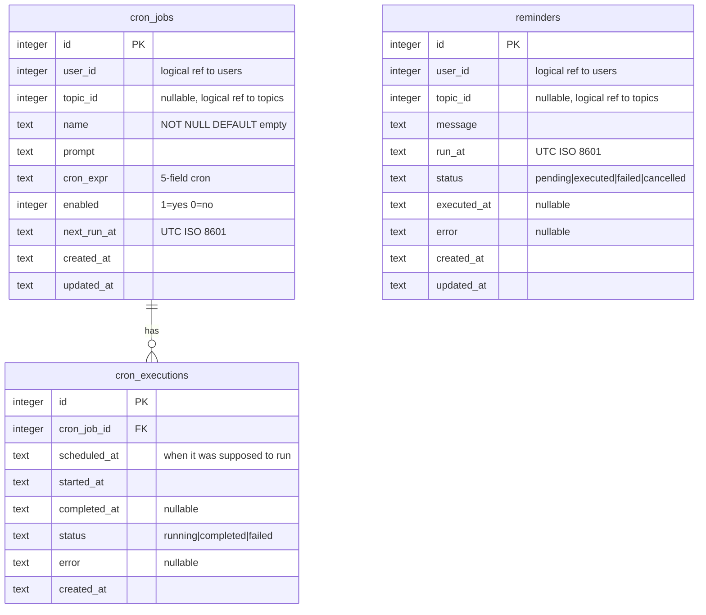

# feat: Reminders and Scheduled Prompts

## Overview

Add two new tools to bobot — **remind** (one-shot time-based reminders) and **cron** (recurring scheduled prompts) — backed by an in-process coalescing scheduler. Includes a web UI at `/schedules` for managing recurring prompts. Scheduled prompts execute through the full LLM pipeline as if the user typed them.

## Problem Statement / Motivation

Users want bobot to proactively reach out at specific times — whether it's a one-off "remind me to call the dentist at 3pm" or a recurring "every weekday at 9am summarize my open tasks". Currently bobot is entirely request-driven with no ability to initiate conversations on a schedule.

## Proposed Solution

### Architecture

```
┌─────────────┐     ┌──────────────┐     ┌──────────────┐
│ remind tool  │────>│              │     │              │
│ cron tool    │────>│  ScheduleDB  │<────│  Scheduler   │
│ /schedules UI│────>│  (SQLite)    │     │  (goroutine) │
└─────────────┘     └──────────────┘     └──────┬───────┘
                                                │
                                    ┌───────────▼───────────┐
                                    │   ChatPipeline        │
                                    │ (save msg → engine →  │
                                    │  broadcast → push)    │
                                    └───────────────────────┘
```

**Key components:**

1. **ScheduleDB** (`tools/schedule/db.go`) — SQLite DB with `reminders`, `cron_jobs`, and `cron_executions` tables. Also contains `Reminder`, `CronJob`, `CronExecution` struct definitions.
2. **RemindTool** (`tools/schedule/remind.go`) — `tools.Tool` for one-shot reminders
3. **CronTool** (`tools/schedule/cron.go`) — `tools.Tool` for recurring prompts
4. **Cron parser** (`tools/schedule/cron_parser.go`) — minimal custom cron expression parser
5. **Scheduler** (`scheduler/scheduler.go`) — in-process goroutine with 1-minute tick, coalescing execution
6. **ChatPipeline** (`server/pipeline.go`) — extracted from `server/chat.go` so both WebSocket handlers and the scheduler can send messages through the same flow. Created in `main.go` and injected into both `Server` and `Scheduler`.
7. **Web UI** — `/schedules` page for CRUD on cron jobs (list, edit, delete, enable/disable)

**Package structure:** Both tools and the DB live in a single `tools/schedule/` package (matching the self-contained pattern of `tools/task/`). The scheduler lives in a separate `scheduler/` package since it has different dependencies (pipeline, coreDB).

### Data Model

**Note:** `user_id` and `topic_id` are logical references only — ScheduleDB is a separate SQLite file (`tool_schedule.db`) so cross-database foreign keys are not enforced. Integrity is checked in application code.



**Required indexes** (queried every minute by the scheduler):
```sql
CREATE INDEX idx_reminders_due ON reminders(status, run_at);
CREATE INDEX idx_cron_jobs_due ON cron_jobs(enabled, next_run_at);
```

## Technical Approach

### Implementation Phases

#### Phase 1: Foundation (scheduler infrastructure + remind tool)

Build the core infrastructure: config, timezone support, ScheduleDB, ChatPipeline extraction, Scheduler goroutine, graceful shutdown, and the remind tool.

##### 1.1 Configuration

Add `ScheduleConfig` to `config/config.go` so the scheduler and tools can reference it from the start.

**Files:**
- `config/config.go` — add `Schedule ScheduleConfig` to `Config` struct

```go
type ScheduleConfig struct {
    Timeout     time.Duration // BOBOT_SCHEDULE_TIMEOUT, default 5m
    MaxCronJobs int           // BOBOT_MAX_CRON_JOBS, default 10
}
```

##### 1.2 Timezone strategy

**No dedicated timezone column or manual setting.** The LLM already knows the user's timezone from the auto-extracted profile (via `update-profiles` CLI), which is included in the system prompt at chat time.

- **LLM tool calls**: The LLM interprets "3pm" using the user's profile timezone and produces a UTC datetime in `run_at`. The tool stores UTC as-is.
- **Slash commands** (`/remind`, `/cron`): Always expect UTC datetimes. Simple and unambiguous.
- **Cron expression evaluation**: The scheduler evaluates cron expressions in UTC. The LLM can inform the user what UTC offset to use when creating cron jobs via natural language.

This avoids adding DB schema changes for timezone and keeps the implementation simple.

##### 1.3 ScheduleDB

New SQLite database at `tool_schedule.db` with the three tables above. Model structs (`Reminder`, `CronJob`, `CronExecution`) are defined in this file following the `tools/task/db.go` pattern.

**Files:**
- `tools/schedule/db.go` — `ScheduleDB` struct, model structs, constructor, `migrate()` with indexes, CRUD methods
- `tools/schedule/db_test.go` — test coverage for CRUD operations and due-job queries

**CRUD methods needed:**

```go
// tools/schedule/db.go

// Reminders
CreateReminder(userID int64, topicID *int64, message string, runAt time.Time) (int64, error)
GetReminder(id int64) (*Reminder, error)
ListPendingReminders(userID int64) ([]Reminder, error)
CancelReminder(id, userID int64) error
GetDueReminders(now time.Time) ([]Reminder, error)
MarkReminderExecuted(id int64, executedAt time.Time) error
MarkReminderFailed(id int64, errMsg string) error

// Cron jobs
CreateCronJob(userID int64, topicID *int64, name, prompt, cronExpr string, nextRunAt time.Time) (int64, error)
GetCronJob(id int64) (*CronJob, error)
ListCronJobs(userID int64) ([]CronJob, error)
ListCronJobsByTopic(topicID int64) ([]CronJob, error)
UpdateCronJob(id, userID int64, name, prompt, cronExpr string, enabled bool, nextRunAt time.Time) error
DeleteCronJob(id, userID int64) error
GetDueCronJobs(now time.Time) ([]CronJob, error)
UpdateCronJobNextRun(id int64, nextRunAt time.Time) error

// Executions
CreateExecution(cronJobID int64, scheduledAt, startedAt time.Time) (int64, error)
CompleteExecution(id int64, completedAt time.Time) error
FailExecution(id int64, completedAt time.Time, errMsg string) error
```

##### 1.4 Extract ChatPipeline

Extract the message flow from `server/chat.go` into a reusable component that both WebSocket handlers and the scheduler can call. The pipeline does NOT handle slash commands — those remain in the WebSocket handler.

**Current flow in `handlePrivateChatMessage` (chat.go:87-149):**
1. Save user message to DB (`CreatePrivateMessageWithContextThreshold`)
2. Broadcast user message via WebSocket (`connections.Broadcast`)
3. Call `engine.Chat(ctx, opts)` — engine saves assistant response via `MessageSaver`
4. Broadcast assistant response via WebSocket
5. Push notification if user is offline

**Approach:** Create a `ChatPipeline` struct in `server/pipeline.go`. The pipeline is created in `main.go` and injected into both `Server` and `Scheduler` to avoid import cycles.

```go
// server/pipeline.go

type ChatPipeline struct {
    db          *db.CoreDB
    engine      *assistant.Engine
    connections *ConnectionRegistry
    pushSender  *push.PushSender
    cfg         *config.Config
}

// SendPrivateMessage saves the user message to DB, broadcasts it, calls engine.Chat(),
// broadcasts the assistant response, and sends push if offline. Returns the assistant response.
func (p *ChatPipeline) SendPrivateMessage(ctx context.Context, userID int64, content string) (string, error)

// SendTopicMessage saves the user message to the topic, broadcasts to all members,
// calls engine.Chat(), broadcasts the response, and sends push to offline members.
func (p *ChatPipeline) SendTopicMessage(ctx context.Context, userID int64, topicID int64, content string) (string, error)
```

**Wiring in main.go:** The pipeline is created after the engine and before the server:
```go
pipeline := server.NewChatPipeline(coreDB, engine, connections, pushSender, cfg)
srv := server.NewWithAssistant(cfg, coreDB, engine, registry, pipeline)
sched := scheduler.New(scheduleDB, coreDB, pipeline, cfg.Schedule.Timeout)
```
This requires extracting `ConnectionRegistry` creation from the `Server` constructor into `main.go`.

Then refactor `handlePrivateChatMessage` and `handleTopicChatMessage` to call `pipeline.SendPrivateMessage` / `pipeline.SendTopicMessage`.

**Files:**
- `server/pipeline.go` — new file with `ChatPipeline`
- `server/chat.go` — refactor handlers to use `ChatPipeline`
- `server/server.go` — accept `pipeline` in constructor, extract `ConnectionRegistry` creation

##### 1.5 Scheduler

In-process goroutine that ticks every minute and executes due jobs globally serially. Includes lifecycle guards from the start — blocked users, deleted topics, and removed members are checked before every execution.

**Files:**
- `scheduler/scheduler.go` — `Scheduler` struct, `Start(ctx)`, `Stop()`, tick loop
- `scheduler/scheduler_test.go` — test coalescing, lifecycle guards, timeout behavior

```go
// scheduler/scheduler.go

type Scheduler struct {
    scheduleDB *schedule.ScheduleDB
    coreDB     *db.CoreDB
    pipeline   *server.ChatPipeline
    timeout    time.Duration
}

func (s *Scheduler) Start(ctx context.Context)
func (s *Scheduler) tick(ctx context.Context)
func (s *Scheduler) executeReminder(ctx context.Context, r *schedule.Reminder) error
func (s *Scheduler) executeCronJob(ctx context.Context, j *schedule.CronJob) error
```

**Tick loop logic:**
1. Query `GetDueReminders(now)` and `GetDueCronJobs(now)` — snapshot at tick start
2. Sort all due items by scheduled time (oldest first)
3. For each item (globally serial):
   - **Lifecycle guards** (checked before each execution):
     - Skip if user is blocked (`coreDB.GetUser(userID)` check) — mark reminder as failed / auto-disable cron job
     - Skip if topic is soft-deleted (`coreDB.GetTopic(topicID)` check `deleted_at IS NULL`) — mark failed / auto-disable
     - Skip if user is no longer a topic member — mark failed / auto-disable
   - Create execution context with `auth.ContextWithUserData` and optional `auth.ContextWithChatData`
   - Apply timeout via `context.WithTimeout(ctx, s.timeout)`
   - Call `pipeline.SendPrivateMessage` or `pipeline.SendTopicMessage`
   - Update status/execution records
   - For cron jobs: compute `next_run_at` from `time.Now()` in UTC (not from the missed schedule)

**Message format injected into chat:**
- Reminders: `"[Reminder] <message>"` — the `[Reminder]` prefix helps the LLM understand context
- Cron jobs: `"[Scheduled] <prompt>"` — same pattern
- These appear as role "user" messages in chat history. The LLM responds naturally.

**Timeout behavior:** When the 5-minute timeout fires:
1. The context is cancelled, aborting the LLM call
2. The execution is marked as failed with error "execution timeout"
3. For cron jobs, `next_run_at` is still updated to prevent re-firing the same missed window

**Coalescing logic for cron jobs:**
- Query returns jobs where `next_run_at <= now AND enabled = 1`
- Execute once regardless of how many intervals were missed
- After execution, set `next_run_at = cronParser.Next(time.Now(), cronExpr)` — this naturally skips all missed intervals
- All cron expressions are evaluated in UTC

**Startup catch-up:** On first tick after restart, the scheduler processes all due items. If the backlog is large (e.g., after extended downtime), items execute serially with timeouts. Log a warning when backlog exceeds 10 items.

##### 1.6 Graceful shutdown

Replace `http.ListenAndServe` with `http.Server` + signal handling in `main.go`.

**Shutdown sequence:**
1. Receive SIGINT/SIGTERM
2. Cancel the scheduler context — no new executions start, but in-flight execution continues
3. Call `http.Server.Shutdown(ctx)` with 30-second timeout — stops accepting new HTTP connections, drains in-flight requests
4. Wait for in-flight scheduler execution to complete (up to `BOBOT_SCHEDULE_TIMEOUT`)
5. Close databases (scheduleDB, coreDB, taskDB, etc.)
6. Exit

**Files:**
- `main.go` — add `signal.Notify(SIGINT, SIGTERM)`, `http.Server`, shutdown orchestration

##### 1.7 Remind tool

The `remind` tool for one-shot reminders.

**Files:**
- `tools/schedule/remind.go` — `RemindTool` struct implementing `tools.Tool`
- `tools/schedule/remind_test.go` — test `ParseArgs`, `Execute` sub-commands

**Constructor:** `func NewRemindTool(schedDB *ScheduleDB) *RemindTool`

**Schema (for LLM):**
```json
{
  "type": "object",
  "properties": {
    "command": {
      "type": "string",
      "enum": ["create", "list", "cancel"]
    },
    "message": {
      "type": "string",
      "description": "The reminder message"
    },
    "run_at": {
      "type": "string",
      "description": "When to fire the reminder, ISO 8601 datetime in UTC (e.g. 2026-02-12T15:00:00Z). Convert from user's local time using their profile timezone."
    },
    "id": {
      "type": "integer",
      "description": "Reminder ID (for cancel)"
    }
  },
  "required": ["command"]
}
```

**Timezone handling:** All `run_at` values are stored and expected in UTC. When the LLM handles natural language ("remind me at 3pm"), it converts to UTC using the user's timezone from their profile. When using the slash command, the user provides UTC directly.

**Slash command format:** `/remind <ISO-datetime-UTC> <message>`
- Example: `/remind 2026-02-12T20:00Z call the dentist`
- For natural language, the LLM converts to UTC before calling the tool

**Sub-commands:**
- `create` — create a new reminder (validates `run_at` is in the future)
- `list` — list pending reminders for the current user (filters by topic context if in a topic chat via `ChatData.TopicID`)
- `cancel` — cancel a pending reminder by ID (ownership check)

##### 1.8 Wire up in main.go

Register the remind tool, create ScheduleDB, create ChatPipeline, create Scheduler, start it.

**Files:**
- `main.go` — add ScheduleDB init, extract ConnectionRegistry creation, create ChatPipeline, register RemindTool, create Scheduler, start before ListenAndServe

---

#### Phase 2: Cron tool + parser

##### 2.1 Cron parser

Minimal custom parser supporting a subset of standard 5-field cron syntax.

**Supported syntax:**
- Fields: `minute hour day-of-month month day-of-week`
- Wildcards: `*`
- Numeric values: `0`, `9`, `15`
- Ranges: `1-5`
- Step values: `*/15`, `1-5/2`
- Lists: `1,3,5`
- **Not supported:** named days/months (`MON`, `JAN`), `@` shortcuts (`@daily`), `L`, `W`, `#`

**Files:**
- `tools/schedule/cron_parser.go` — `Parse(expr string) (*CronExpr, error)`, `(*CronExpr).Next(from time.Time, loc *time.Location) time.Time`
- `tools/schedule/cron_parser_test.go` — thorough test coverage including DST edge cases

**UTC-only evaluation:** Since all cron expressions are evaluated in UTC, DST is not a concern for the parser. The LLM handles the user's local timezone when creating cron jobs via natural language (e.g., "every weekday at 9am EST" → the LLM converts to the equivalent UTC cron expression `0 14 * * 1-5`).

`Next()` signature: `func (c *CronExpr) Next(from time.Time) time.Time` — returns the next UTC time matching the expression after `from`.

**Minimum interval validation:** `MinInterval(expr *CronExpr) time.Duration` — computes the shortest possible gap between two consecutive firings. Used by the cron tool to reject expressions with intervals < 15 minutes.

##### 2.2 Cron tool

**Files:**
- `tools/schedule/cron.go` — `CronTool` struct implementing `tools.Tool`
- `tools/schedule/cron_test.go` — test `ParseArgs`, `Execute` sub-commands, limit enforcement

**Constructor:** `func NewCronTool(schedDB *ScheduleDB, coreDB *db.CoreDB, maxJobs int) *CronTool`

**Schema (for LLM):**
```json
{
  "type": "object",
  "properties": {
    "command": {
      "type": "string",
      "enum": ["create", "list", "delete", "enable", "disable"]
    },
    "prompt": {
      "type": "string",
      "description": "The prompt to run on schedule"
    },
    "cron_expr": {
      "type": "string",
      "description": "5-field cron expression (minute hour day-of-month month day-of-week)"
    },
    "name": {
      "type": "string",
      "description": "Optional human-readable name for the cron job"
    },
    "id": {
      "type": "integer",
      "description": "Cron job ID (for delete/enable/disable)"
    }
  },
  "required": ["command"]
}
```

**Slash command format:** `/cron <cron-expr-5-fields> <prompt>`
- Example: `/cron 0 9 * * 1-5 summarize my open tasks`
- First 5 space-separated tokens are the cron expression, rest is the prompt

**Sub-commands:**
- `create` — create a new cron job (validates cron_expr, enforces min interval, computes next_run_at in UTC)
- `list` — list user's cron jobs with next run time (filters by topic context if in a topic chat via `ChatData.TopicID`)
- `delete` — delete by ID (ownership check)
- `enable` / `disable` — toggle a cron job (ownership check)

**Limits:**
- Max 10 active cron jobs per user (configurable via `BOBOT_MAX_CRON_JOBS`, default 10)
- Minimum interval: 15 minutes (reject cron expressions that would fire more frequently)

##### 2.3 Wire cron tool in main.go

**Files:**
- `main.go` — register CronTool

---

#### Phase 3: Web UI

##### 3.1 Schedules page (list)

**Files:**
- `web/templates/schedules.html` — list template following skills.html pattern
- `server/schedules.go` — `handleSchedulesPage` handler
- `server/pages.go` — add `ScheduleView` struct, load template, add PageData fields
- `server/server.go` — register `GET /schedules` route

**List page shows:**
- Cron job name (or truncated prompt if no name)
- Cron expression in human-readable form (e.g., "Weekdays at 9:00 AM")
- Next run time in user's timezone
- Enabled/disabled badge
- Scope: "Private" or topic name

##### 3.2 Schedule form page (create/edit)

**Files:**
- `web/templates/schedule_form.html` — form template following skill_form.html pattern
- `server/schedules.go` — `handleScheduleFormPage`, `handleCreateScheduleForm`, `handleUpdateScheduleForm`, `handleDeleteScheduleForm`
- `server/server.go` — register `GET /schedules/new`, `GET /schedules/{id}/edit`, `POST /schedules`, `POST /schedules/{id}`, `DELETE /schedules/{id}`

**Form fields:**
- Name (optional text input)
- Prompt (textarea)
- Cron expression (text input with validation)
- Enabled (checkbox)
- Scope: private or topic selector (only topics user belongs to)

**Validation:** server-side cron expression validation with user-friendly error messages.

##### 3.3 Navigation

**Files:**
- `web/templates/chat.html` — add "Schedules" menu item in hamburger menu
- `web/templates/topic_chat.html` — add "Schedules" menu item (with `?topic_id=`)
- `server/pages.go` — add `/schedules` to `validateNavigatePath()`

---

#### Phase 4: Polish

##### 4.1 Push notification formatting

When the scheduler sends messages via the ChatPipeline, customize push notification titles:
- Reminders: title "Reminder", body = LLM response truncated to 200 chars
- Cron jobs: title "Scheduled" (or cron job name if set), body = LLM response truncated
- Topic-scoped: title includes topic name (e.g., "Scheduled in #team")

## Acceptance Criteria

### Functional Requirements

- [x] Users can create one-shot reminders via natural language ("remind me to X at Y")
- [x] Users can create one-shot reminders via `/remind <datetime> <message>`
- [x] Users can list and cancel pending reminders
- [x] Reminders fire at the scheduled time as a chat message + push notification
- [x] The LLM responds to reminder messages as if the user typed them
- [x] Users can create recurring prompts via natural language or `/cron`
- [x] Users can manage recurring prompts via the `/schedules` web UI (list, edit, delete, enable/disable)
- [x] Recurring prompts execute on schedule through the full LLM pipeline
- [x] Schedules work in both private chat and topics
- [x] Missed runs (server downtime) execute once on recovery (coalescing)
- [x] Long-running executions don't cause accumulation — `next_run_at` computed from completion time
- [x] Global serial execution — one scheduled job runs at a time
- [x] 5-minute configurable timeout per execution
- [x] All times stored and evaluated in UTC; LLM handles local timezone conversion via user profile
- [x] Blocked users' schedules are skipped
- [x] Topic-scoped schedules stop when topic is deleted or user is removed

### Non-Functional Requirements

- [x] Scheduler tick interval: ~1 minute
- [x] Max 10 cron jobs per user (configurable)
- [x] Minimum cron interval: 15 minutes
- [x] Graceful shutdown: in-flight execution completes before server stops
- [x] Cron parser operates in UTC (no DST concerns)

## Dependencies & Risks

**Dependencies:**
- Existing `assistant.Engine.Chat()` works without WebSocket context (confirmed — it's context-driven)
- Existing `ConnectionRegistry.Broadcast()` and `push.PushSender.NotifyUser()` are available outside WebSocket handlers (confirmed — they're on the Server struct)

**Risks:**
- **Context window pollution**: frequent cron jobs (e.g., every 15 min) will fill the LLM context window with automated messages, pushing out real user conversation. Mitigation: document this trade-off, enforce 15-min minimum interval.
- **Global serial bottleneck**: one slow execution blocks all users. Mitigation: 5-min timeout, logging when execution approaches timeout.
- **Custom cron parser bugs**: Edge cases in cron expression evaluation. Mitigation: thorough test coverage. UTC-only simplifies this significantly (no DST concerns).
- **LLM timezone accuracy**: The LLM converts user's local time to UTC based on profile data. If the profile doesn't have timezone info, the conversion may be wrong. Mitigation: the LLM can ask the user for their timezone if unclear.

## References & Research

### Internal References
- Tool interface: `tools/registry.go:11-18`
- Tool registration: `main.go:84-105`
- Tool-specific DB pattern: `tools/task/db.go:36-76`
- Chat message flow: `server/chat.go:87-149`
- WebSocket broadcast: `server/connections.go:18-71`
- Push notifications: `push/push.go`
- Skills CRUD UI: `server/skills.go`, `web/templates/skills.html`
- Navigation menus: `web/templates/chat.html:23`, `web/templates/topic_chat.html:31`
- Config loading: `config/config.go:66-111`
- DB migration: `db/core.go:117-413`
- Context injection: `auth/context.go:14-23`

### Brainstorm
- `docs/brainstorms/2026-02-12-reminders-and-scheduled-prompts-brainstorm.md`
