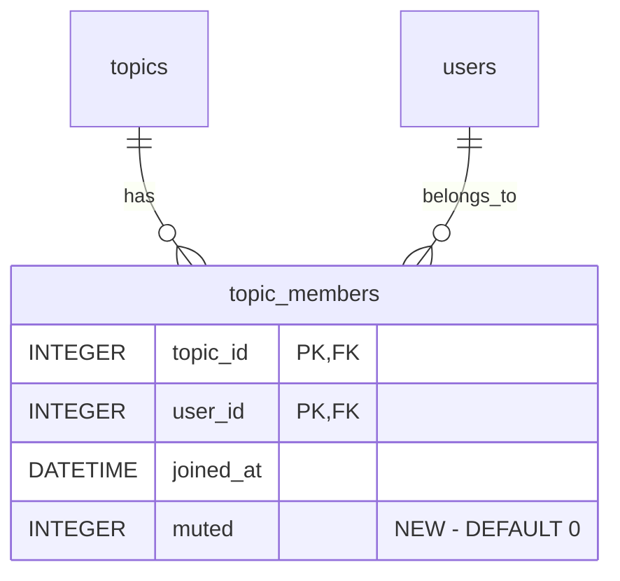

# feat: Per-topic push notification mute

## Overview

Allow users to mute push notifications for individual topic (group) chats. When muted, a user stops receiving Web Push notifications for that topic but still sees unread dots and messages in the app. Private chat with Bobot is excluded.

## Problem Statement

Push notifications are currently all-or-nothing. When enabled, users receive push for every topic they belong to. Active topics with frequent messages can become noisy, causing users to disable push entirely rather than selectively silencing specific topics.

## Proposed Solution

Add a `muted` boolean column to `topic_members` (DEFAULT 0, opt-out model). Check this flag in `pushToTopicMembers()` before sending push. Expose a toggle in the topic chat menu, visible only when global push is enabled.

## Technical Approach

### Database

Add column via existing `addColumnIfMissing()` migration helper in `db/core.go`:

```sql
ALTER TABLE topic_members ADD COLUMN muted INTEGER NOT NULL DEFAULT 0
```

Update `TopicMember` struct:

```go
type TopicMember struct {
    UserID      int64
    Username    string
    DisplayName string
    JoinedAt    time.Time
    Muted       bool  // new field
}
```

Update `GetTopicMembers()` query (db/core.go:1299) to SELECT `tm.muted`.

New DB method:

```go
func (c *CoreDB) SetTopicMemberMuted(topicID, userID int64, muted bool) error
```

Simple UPDATE on `topic_members SET muted = ? WHERE topic_id = ? AND user_id = ?`.

### Server -- Push Logic

Both `pushToTopicMembers()` implementations must be updated:

- `server/chat.go:212` (user messages + assistant responses via WebSocket)
- `server/pipeline.go:134` (scheduler-initiated messages)

In the member iteration loop, add check:

```go
if member.Muted {
    continue
}
```

This goes after the existing `member.UserID == senderID || member.UserID == db.BobotUserID` check and before the `connections.Count` check.

`broadcastToTopic()` is NOT affected -- messages are still delivered via WebSocket regardless of mute. Only push is suppressed.

### API Endpoints

```
POST   /api/topics/{id}/mute    -> sets muted=true  -> 204 No Content
DELETE /api/topics/{id}/mute    -> sets muted=false  -> 204 No Content
```

Both endpoints:
- Require session auth (wrapped in `sessionMiddleware`)
- Verify user is a member of the topic (return 403 if not)
- Are idempotent (muting an already-muted topic returns 204)
- Return 404 if topic doesn't exist or is soft-deleted

Register in `server/server.go` routes():

```go
s.router.HandleFunc("POST /api/topics/{id}/mute", s.sessionMiddleware(s.handleMuteTopic))
s.router.HandleFunc("DELETE /api/topics/{id}/mute", s.sessionMiddleware(s.handleUnmuteTopic))
```

Handlers go in a new file `server/topic_mute.go` (or in existing `server/topics.go`).

### UI -- Template

In `web/templates/topic_chat.html`, add a mute button below the global push toggle:

```html
<button class="menu-item" data-mute-toggle
    data-topic-id="{{.TopicID}}"
    data-muted="{{.PushMuted}}"
    style="display:none">
    {{if .PushMuted}}Unmute topic{{else}}Mute topic{{end}}
</button>
```

Starts hidden (`display:none`), made visible by JS when global push is enabled.

### UI -- PageData

In `server/pages.go`, add `PushMuted bool` to `PageData`. In `handleTopicChatPage()`, after the existing `GetTopicMembers()` call, find the current user's member record and read its `Muted` field to populate `PushMuted`.

### UI -- JavaScript

Extend `push.js`'s `updateButtons()` function to also manage `[data-mute-toggle]` elements:
- When global push is enabled: show the mute button, set correct text based on `data-muted` attribute
- When global push is disabled: hide the mute button

The mute button's click handler uses `fetch()` (not HTMX) to call the mute/unmute API, matching the existing push subscription pattern. After server response (not optimistic), toggle `data-muted` attribute and update button text.

### Edge Cases

- **Leave and rejoin**: `RemoveTopicMember()` deletes the row (including muted flag). Rejoin inserts fresh row with `muted=0`. Mute resets on rejoin -- acceptable behavior.
- **Race condition**: User mutes topic while push is being sent. Benign race -- at most one extra notification. Acceptable.
- **Mute without global push**: API allows it (harmless), but UI hides the button when push is disabled. If user mutes, then disables global push, then re-enables -- mute state persists correctly.

## Acceptance Criteria

- [x] `topic_members` table has `muted` column (INTEGER NOT NULL DEFAULT 0)
- [x] `TopicMember` struct includes `Muted bool` field
- [x] `GetTopicMembers()` returns muted status
- [x] `SetTopicMemberMuted()` DB method works correctly
- [x] `pushToTopicMembers()` in `server/chat.go` skips muted members
- [x] `pushToTopicMembers()` in `server/pipeline.go` skips muted members
- [x] `POST /api/topics/{id}/mute` sets muted=true, returns 204
- [x] `DELETE /api/topics/{id}/mute` sets muted=false, returns 204
- [x] Mute/unmute endpoints verify topic membership
- [x] Topic chat menu shows "Mute topic" / "Unmute topic" when global push is enabled
- [x] Mute button hidden when global push is disabled
- [x] Button text updates after successful server response
- [x] Unread dots and WebSocket message delivery are NOT affected by mute
- [x] Private Bobot chat does NOT have a mute button

## Implementation Steps

### Step 1: Database layer
- Add `muted` column to `topic_members` via `addColumnIfMissing()` in `db/core.go` migrate()
- Add `Muted bool` to `TopicMember` struct
- Update `GetTopicMembers()` SELECT to include `tm.muted`
- Add `SetTopicMemberMuted(topicID, userID int64, muted bool) error` method

**Files:** `db/core.go`

### Step 2: Push logic
- Update `pushToTopicMembers()` in `server/chat.go` to check `member.Muted`
- Update `pushToTopicMembers()` in `server/pipeline.go` to check `member.Muted`

**Files:** `server/chat.go`, `server/pipeline.go`

### Step 3: API endpoints
- Add `handleMuteTopic` and `handleUnmuteTopic` handlers
- Register routes in `server/server.go`

**Files:** `server/topics.go` (or new `server/topic_mute.go`), `server/server.go`

### Step 4: Template and page data
- Add `PushMuted bool` to `PageData` in `server/pages.go`
- Populate `PushMuted` in `handleTopicChatPage()`
- Add `data-mute-toggle` button to `web/templates/topic_chat.html`

**Files:** `server/pages.go`, `web/templates/topic_chat.html`

### Step 5: Client-side JS
- Extend `push.js` `updateButtons()` to manage `[data-mute-toggle]` visibility
- Add click handler for mute/unmute using `fetch()` API calls
- Update button text and `data-muted` attribute after server response

**Files:** `web/static/push.js`

## References

- Brainstorm: `docs/brainstorms/2026-02-21-topic-mute-notifications-brainstorm.md`
- Push notifications plan: `docs/plans/2026-02-11-feat-push-notifications-plan.md`
- Migration helper: `db/core.go:448` (`addColumnIfMissing`)
- Push to topic members: `server/chat.go:212`, `server/pipeline.go:134`
- Topic chat template: `web/templates/topic_chat.html:21-41`
- Push JS: `web/static/push.js:123-139` (`updateButtons`)
- Topic member DB methods: `db/core.go:1165-1321`


