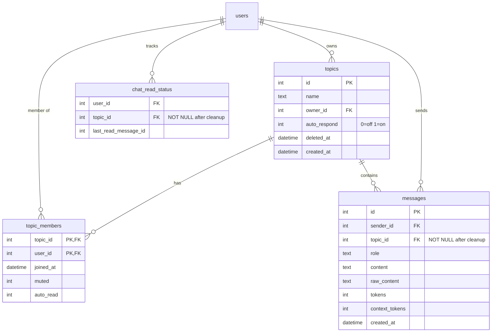

# Unify Private Chats and Topics

## Overview

Combine private chats (1:1 with Bobot) and topics into a single unified concept. Every conversation becomes a "topic" — a private chat is a topic with one member, a group chat is a topic with multiple members. This eliminates the dual code paths currently maintained for private and topic chat across the DB, server, and frontend.

## Problem Statement

The codebase maintains parallel implementations for private chat and topic chat:

- **DB**: `CreatePrivateMessageWithContextThreshold` vs `CreateTopicMessageWithContext`, separate query patterns (`sender_id/receiver_id` vs `topic_id`)
- **Server**: `handlePrivateChatMessage` vs `handleTopicChatMessage`, `SendPrivateMessage` vs `SendTopicMessage`
- **Frontend**: `chat.js` vs `topic_chat.js`, `chat.html` vs `topic_chat.html`
- **APIs**: `/api/messages/history` vs `/api/topics/{id}/messages/history`
- **Read status**: `PrivateChatTopicID=0` sentinel, `WHERE topic_id IS NULL` special cases

Every new feature must be implemented twice. The engine was already unified (ChatOptions with TopicID branching), but the server, DB, and frontend remain split.

## Proposed Solution

Unify everything under topics. Migrate existing private messages into per-user "bobot" topics. Add configurable `auto_respond` per topic. Deliver as 4 phases (separate PRs), each leaving the app functional.

## Technical Approach

### Architecture

After unification, the message flow for ALL chats becomes:

```
Client → WS {content, topic_id} → handleTopicChatMessage → CreateTopicMessageWithContext
                                                         → broadcastToTopic
                                                         → if auto_respond || @bobot → engine.Chat
```

No more `topic_id IS NULL`, no more `receiver_id`, no more `PrivateChatTopicID` sentinel.

### ERD (After Migration)



### Implementation Phases

#### Phase 1: Schema Preparation
Add `auto_respond` column, create bobot topics on signup, helper functions. No data migration yet — existing private chat continues to work as-is.

#### Phase 2: Data Migration + Backend Unification
Migrate existing private messages into bobot topics (in `migrate()`), then unify all server code paths to use topic-only approach. These must deploy together — migrating data without updating the backend would leave a gap where new private messages get `topic_id IS NULL` again.

#### Phase 3: Frontend Unification
Merge JS files and templates. Update WS dispatch to use topic-only events.

#### Phase 4: Cleanup
Drop `receiver_id` column, remove dead code, old routes, unused constants.

---

## Phase 1: Schema Preparation

### Task 1.1: Add `auto_respond` column to topics table

**Files:**
- `db/core.go` — Add migration, update `Topic` struct

**Changes:**
1. In `migrate()`, add: `addColumnIfMissing("topics", "auto_respond", "INTEGER NOT NULL DEFAULT 0")`
2. Add `AutoRespond bool` to `Topic` struct (line ~74)
3. Update `GetTopicByID` query to include `auto_respond` (line ~1275)
4. Update `GetUserTopics` query to include `auto_respond` (line ~1335)

**Tests:** Verify migration is idempotent, verify `Topic.AutoRespond` is populated.

### Task 1.2: Add `CreateBobotTopic` DB helper

**Files:**
- `db/core.go` — Add new function

**Changes:**
Add a helper that creates a "bobot" topic for a user in a single transaction:
```go
func (db *CoreDB) CreateBobotTopic(userID int64) (*Topic, error)
```

This function:
1. Creates topic: `INSERT INTO topics (name, owner_id, auto_respond) VALUES ('bobot', ?, 1)`
2. Adds user as member: `INSERT INTO topic_members (topic_id, user_id) VALUES (?, ?)`
3. Returns the created topic

Note: Topic name "bobot" is NOT unique (each user gets their own). The existing unique index `idx_topics_name_active` on `LOWER(name)` would conflict. Need to drop that unique constraint or change the approach. Since multiple users can have a topic named "bobot", the unique index must be removed or scoped differently.

**Decision:** Drop the unique name index. Topic names don't need to be globally unique — they're scoped to their members. Add a new helper index if needed for lookups.

**Tests:** Verify topic creation, membership, and `auto_respond = true`.

### Task 1.3: Add `GetUserBobotTopic` DB helper

**Files:**
- `db/core.go` — Add new function

**Changes:**
```go
func (db *CoreDB) GetUserBobotTopic(userID int64) (*Topic, error)
```

Looks up the user's "bobot" topic by joining `topics` and `topic_members` where `name = 'bobot'` and `owner_id = userID`. Returns nil if not found.

Used by:
- WS handler to resolve `topic_id: null` to bobot topic (Phase 2)
- Chat page redirect (Phase 2)

**Tests:** Verify lookup returns correct topic, returns nil when not found.

### Task 1.4: Update signup to create bobot topic

**Files:**
- `server/signup.go` — After user creation, create bobot topic

**Changes:**
At `server/signup.go:107-120`, after `CreateUserFull` and before the welcome message:
1. Call `s.db.CreateBobotTopic(user.ID)` to create the bobot topic
2. Change welcome message from `CreateMessage(BobotUserID, user.ID, ...)` to `CreateTopicMessageWithContext(bobotTopic.ID, BobotUserID, "assistant", WelcomeMessage, WelcomeMessage, ...)`

**Tests:** Verify signup creates user + bobot topic + welcome message in topic.

---

## Phase 2: Data Migration + Backend Unification

> **Deploy together.** Data migration and backend changes must ship as one unit.

### Task 2.1: Migrate existing private messages to bobot topics

**Files:**
- `db/core.go` — Add migration step in `migrate()`

**Changes:**
Add migration logic at the end of `migrate()`:
1. Query all users (excluding BobotUserID=0)
2. For each user without a bobot topic: call `CreateBobotTopic(userID)`
3. Update their private messages:
   ```sql
   UPDATE messages SET topic_id = ?
   WHERE topic_id IS NULL
   AND (sender_id = ? OR receiver_id = ?)
   ```
4. Migration is idempotent: skip users who already have a bobot topic

**Important edge cases:**
- `context_tokens` values remain valid — they track token accumulation within the conversation, which doesn't change when moving to a topic
- Messages where `sender_id = BobotUserID` and `receiver_id = userID` get the same `topic_id` — this is correct
- The bidirectional index `idx_messages_private_chat` becomes unused after migration but doesn't break anything (cleanup in Phase 4)

**Tests:** Create test DB with private messages, run migration, verify all messages have `topic_id` set.

### Task 2.2: Unify WebSocket handler

**Files:**
- `server/chat.go` — Merge handlers

**Changes:**
1. In `handleChat` dispatch (line 58-62): When `msg.TopicID` is nil, look up user's bobot topic via `GetUserBobotTopic(userID)` and set `msg.TopicID` to it. Then always call `handleTopicChatMessage`.
2. Remove `handlePrivateChatMessage` entirely.
3. Update `handleTopicChatMessage` to use `auto_respond` instead of `shouldTriggerAssistant`:
   ```go
   topic, _ := s.db.GetTopicByID(topicID)
   if topic.AutoRespond || shouldTriggerAssistant(content) {
       s.handleTopicAssistantResponse(ctx, userID, topicID, content, user.DisplayName)
   }
   ```
4. Update slash command handling in `handleTopicChatMessage`: the `receiverID` parameter to `handleSlashCommand` becomes nil for all cases (or remove the parameter). ChatData always gets `TopicID` set.
5. Update `handleSlashCommand` signature: remove `receiverID` parameter since all commands now operate in a topic context.

**WS message format (transitional):** Client can still send `{content, topic_id: null}`. Server resolves null to bobot topic. Phase 3 updates clients.

**Tests:** Test WS handler with null `topic_id` resolves to bobot topic. Test `auto_respond` triggers assistant.

### Task 2.3: Unify pipeline

**Files:**
- `server/pipeline.go` — Merge into single method
- `scheduler/scheduler.go` — Update Pipeline interface

**Changes:**
1. Remove `SendPrivateMessage`. Rename `SendTopicMessage` to `SendMessage`:
   ```go
   func (p *ChatPipeline) SendMessage(ctx context.Context, userID, topicID int64, content, displayName string) (string, error)
   ```
2. Update push notification URL: currently `SendPrivateMessage` hardcodes `/chat` as the push URL. The unified method uses `/chats/{topicID}` for all.
3. Update scheduler `Pipeline` interface:
   ```go
   type Pipeline interface {
       SendMessage(ctx context.Context, userID int64, topicID int64, content string, displayName string) (string, error)
   }
   ```
4. Update scheduler callers (`executeReminder`, `executeCronJob`): resolve private reminders/crons (where `TopicID == nil`) to the user's bobot topic before calling `SendMessage`.

**Tests:** Verify unified pipeline works for both single-member and multi-member topics. Verify scheduler still works.

### Task 2.4: Unify DB message queries

**Files:**
- `db/core.go` — Consolidate query functions

**Changes:**
1. Mark as deprecated (but keep for now): `CreatePrivateMessageWithContextThreshold`, `GetPrivateMessages`, `GetPrivateChatRecentMessages`, `GetPrivateChatMessagesBefore`, `GetPrivateChatMessagesSince`, `GetLatestPrivateMessageID`, `GetPrivateChatContextMessages`
2. Ensure all callers use topic-based equivalents: `CreateTopicMessageWithContext`, `GetTopicRecentMessages`, `GetTopicMessagesBefore`, `GetTopicMessagesSince`, `GetLatestTopicMessageID`, `GetTopicContextMessages`
3. No new functions needed — topic-based queries already exist and work correctly

### Task 2.5: Unify read status

**Files:**
- `server/read_status.go` — Remove private chat special cases
- `db/core.go` — Update `MarkChatRead` and `GetUnreadChats`

**Changes:**
1. `markChatReadImplicit`: Remove the `PrivateChatTopicID` branch. Always call `GetLatestTopicMessageID(topicID)`.
2. `MarkChatRead` (db): Remove the `WHERE topic_id IS NULL` branch. Always use `WHERE topic_id = ?`.
3. `GetUnreadChats` (db): Remove the separate private chat unread check. Return only `topicUnreads map[int64]bool` (remove `bobotUnread bool` return value). The bobot topic will appear in the topic unreads map naturally.
4. Migrate existing `chat_read_status` rows where `topic_id IS NULL`: set to user's bobot topic ID (in `migrate()`).

**Tests:** Verify unread tracking works for bobot topics the same as regular topics.

### Task 2.6: Unify page handlers

**Files:**
- `server/pages.go` — Merge chat page into topic chat page
- `server/server.go` — Update routes

**Changes:**
1. `handleChatPage` (line 318-355): Change to redirect to `/chats/{bobotTopicID}`:
   ```go
   func (s *Server) handleChatPage(w http.ResponseWriter, r *http.Request) {
       userData := auth.UserDataFromContext(r.Context())
       topic, err := s.db.GetUserBobotTopic(userData.UserID)
       if err != nil {
           http.Error(w, "not found", 404)
           return
       }
       w.Header().Set("HX-Redirect", fmt.Sprintf("/chats/%d", topic.ID))
       http.Redirect(w, r, fmt.Sprintf("/chats/%d", topic.ID), http.StatusFound)
   }
   ```
2. `handleChatsPage` (line 357-385): Include bobot topic in the topics list. Remove separate `BobotHasUnread` field. All topics (including bobot) appear in a single flat list.
3. `handleTopicChatPage` (line 387-487): Add bobot topic support — when rendering a single-member topic, skip the display name prefix for messages (or keep it consistent).

**Tests:** Verify `/chat` redirects. Verify chats list includes bobot topic. Verify topic chat page works for bobot topic.

### Task 2.7: Unify message history/sync APIs

**Files:**
- `server/messages.go` — Remove private endpoints or redirect

**Changes:**
1. `handleMessageHistory` (`GET /api/messages/history`): Redirect to topic-based endpoint or resolve to bobot topic internally.
2. `handleMessageSync` (`GET /api/messages/sync`): Same — redirect or resolve.
3. Keep old endpoints working during Phase 2 (frontend still uses them). Phase 3 updates the frontend to use topic endpoints.

---

## Phase 3: Frontend Unification

### Task 3.1: Update chats list template

**Files:**
- `web/templates/chats.html`

**Changes:**
1. Remove the separate bobot chat item (lines 10-14)
2. Remove "Topics" section label (line 15)
3. All topics in a single flat list including bobot
4. The bobot topic appears like any other topic (sorted by recency from the server)
5. Keep the "Create new topic" button

### Task 3.2: Merge chat.js into topic_chat.js

**Files:**
- `web/static/topic_chat.js` — Absorb chat.js functionality
- `web/static/chat.js` — Delete

**Changes:**
1. `TopicChatClient` already handles everything `ChatClient` does, plus more (display names, @bobot button, multi-user rendering)
2. For single-member topics (bobot chat): hide the @bobot mention button, hide "Leave topic" option
3. Always send `{content, topic_id}` over WS (no more `topic_id: null`)
4. Listen for `bobot:topic-message` only (or a unified event name)
5. Use `/api/topics/{id}/messages/history` for all history loading
6. Use `/api/topics/{id}/messages/sync` for all sync

### Task 3.3: Merge templates

**Files:**
- `web/templates/topic_chat.html` — Absorb chat.html functionality
- `web/templates/chat.html` — Delete

**Changes:**
1. `topic_chat.html` already has the superset of features
2. For single-member topics: conditionally hide multi-user UI (members list, @bobot button)
3. Add template data to indicate if this is a single-member topic

### Task 3.4: Update ws-manager.js dispatch

**Files:**
- `web/static/ws-manager.js`

**Changes:**
1. All messages now have `topic_id` — remove the `bobot:chat-message` event
2. Dispatch everything as `bobot:topic-message`
3. Or: keep the event name but ensure all messages include `topic_id`

### Task 3.5: Update unread-state.js

**Files:**
- `web/static/unread-state.js`

**Changes:**
1. Remove special handling for `chatId === 0` (PrivateChatTopicID sentinel)
2. All chats are topics with real IDs
3. Initialize from server data which now includes bobot topic in the topic unreads

---

## Phase 4: Cleanup

### Task 4.1: Drop `receiver_id` column

**Files:**
- `db/core.go` — Add migration step, update Message struct

**Changes:**
1. In `migrate()`: `ALTER TABLE messages DROP COLUMN receiver_id` (SQLite >= 3.35.0)
2. Remove `ReceiverID *int64` from `Message` struct
3. Remove from all INSERT/SELECT queries

### Task 4.2: Remove dead DB functions

**Files:**
- `db/core.go`

**Remove:**
- `CreatePrivateMessageWithContextThreshold`
- `GetPrivateMessages` / `GetPrivateChatRecentMessages`
- `GetPrivateChatMessagesBefore` / `GetPrivateChatMessagesSince`
- `GetLatestPrivateMessageID` / `GetPrivateChatContextMessages`
- `CreateMessage` (simple version used only for welcome message, now replaced)
- Private chat indexes: `idx_messages_private_chat`, `idx_messages_context`

### Task 4.3: Remove dead constants and sentinels

**Files:**
- `db/core.go` — Remove `PrivateChatTopicID`
- `server/read_status.go` — Remove any remaining references

### Task 4.4: Remove dead routes

**Files:**
- `server/server.go` — Remove `/api/messages/history`, `/api/messages/sync` routes
- `server/messages.go` — Delete `handleMessageHistory`, `handleMessageSync` (private versions)

### Task 4.5: Remove dead frontend files

**Files:**
- Delete `web/static/chat.js`
- Delete `web/templates/chat.html`

### Task 4.6: Clean up chat_read_status indexes

**Files:**
- `db/core.go`

**Changes:**
1. Remove `idx_chat_read_status_private` (private chat partial index)
2. Simplify to single unique index: `UNIQUE(user_id, topic_id)`

### Task 4.7: Remove unique topic name index

**Files:**
- `db/core.go`

**Changes:**
If not already done in Phase 1, drop `idx_topics_name_active`. Multiple users can have topics with the same name (each user has a "bobot" topic).

---

## Acceptance Criteria

### Functional Requirements

- [ ] New users get a "bobot" topic on signup with auto-respond ON
- [ ] Existing users' private messages are migrated to a "bobot" topic
- [ ] Users can create multiple private topics
- [ ] `auto_respond` setting controls whether assistant responds without @mention
- [ ] All topics appear in a single flat list at `/chats`
- [ ] `/chat` redirects to the user's bobot topic at `/chats/{id}`
- [ ] All chat URLs follow `/chats/{id}` pattern
- [ ] Scheduled messages (reminders/crons) work for both private and topic contexts
- [ ] Push notifications show correct URLs (`/chats/{id}` for all)
- [ ] Unread indicators work consistently for all topics including bobot
- [ ] Slash commands work in all topics
- [ ] Mute, auto-read settings work for bobot topics

### Non-Functional Requirements

- [ ] Migration is idempotent (safe to run multiple times)
- [ ] No data loss during private message migration
- [ ] Each phase leaves the app deployable and functional

## Dependencies & Risks

**SQLite version:** `ALTER TABLE DROP COLUMN` requires SQLite >= 3.35.0 (March 2021). Verify deployment environment.

**Unique topic name index:** Dropping `idx_topics_name_active` means topic names are no longer globally unique. This is intentional — names are scoped to members.

**Scheduler backward compatibility:** Existing reminders/crons with `TopicID = nil` need to be resolved to bobot topics. The scheduler migration must handle this.

**Context window tokens:** Migrated messages keep their `context_tokens` values. Since the sliding window is per-conversation and private messages move to a per-user bobot topic, the context window math remains valid.

## References

- Brainstorm: `docs/brainstorms/2026-02-23-unify-chats-topics-brainstorm.md`
- Prior engine unification: `docs/plans/2026-02-08-unified-chat-design.md`
- Auto-read pattern: `docs/solutions/architecture-patterns/extract-shared-auto-read-marking-logic.md`
- Issue: [#24](https://github.com/esnunes/bobot/issues/24)

### Key Source Files

| Area | File | Key Lines |
|------|------|-----------|
| DB schema/migration | `db/core.go` | 123-457 |
| Message struct | `db/core.go` | 51-62 |
| Topic struct | `db/core.go` | 74-80 |
| Private chat handler | `server/chat.go` | 66-101 |
| Topic chat handler | `server/chat.go` | 103-183 |
| Pipeline | `server/pipeline.go` | 38-122 |
| Read status | `server/read_status.go` | 1-52 |
| Scheduler | `scheduler/scheduler.go` | 127-163 |
| Signup | `server/signup.go` | 107-120 |
| Chat list page | `server/pages.go` | 357-385 |
| Private chat page | `server/pages.go` | 318-355 |
| Topic chat page | `server/pages.go` | 387-487 |
| WS dispatch | `web/static/ws-manager.js` | 61-77 |
| Private chat JS | `web/static/chat.js` | — |
| Topic chat JS | `web/static/topic_chat.js` | — |
| Unread state JS | `web/static/unread-state.js` | — |
