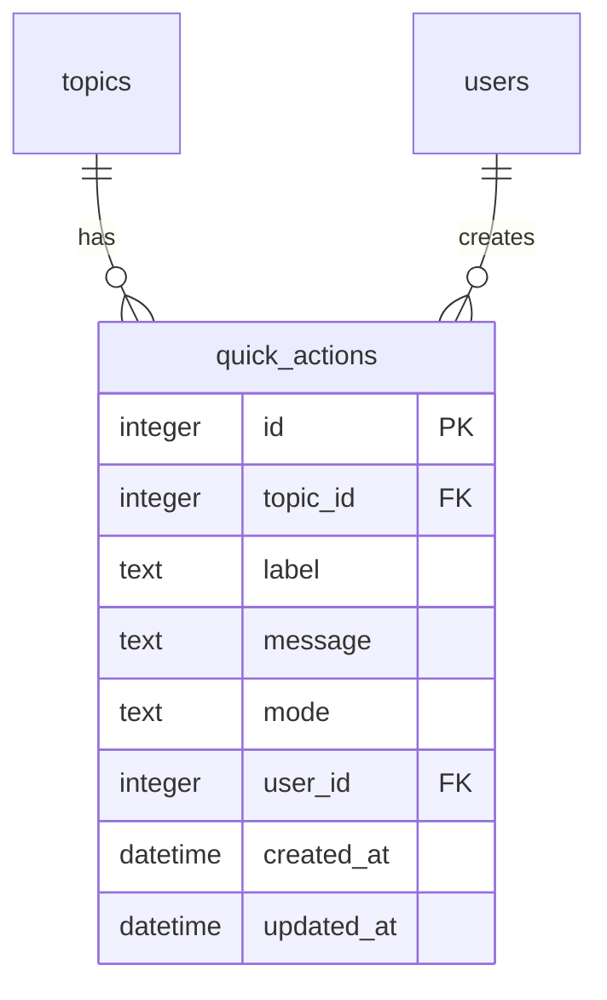

# feat: Quick actions with persistence and CRUD

## Overview

Replace the hardcoded quick actions prototype with a real, persistent implementation. Quick actions are per-topic pre-defined prompts stored in a dedicated `quick_actions` table. All topic members can use them; only topic owners and global admins can manage them. CRUD is available via both the settings UI and a `/quickaction` tool (slash command + LLM tool).

## Problem Statement / Motivation

Users send repetitive messages throughout the day (turn on/off AC, reminders, grocery additions). The prototype (issue #31) validated the UX — lightning bolt button, full-screen overlay, send/fill modes. Now we need real persistence, per-topic scoping, and CRUD so users can customize their quick actions.

## Proposed Solution

Follow the **skills feature pattern exactly**: dedicated DB table, DB CRUD methods, tool implementing the `tools.Tool` interface, server handlers for settings UI, templates for list/form pages, and server-rendered data on the chat page.

### Data Model



```sql
CREATE TABLE IF NOT EXISTS quick_actions (
    id INTEGER PRIMARY KEY AUTOINCREMENT,
    label TEXT NOT NULL,
    message TEXT NOT NULL,
    mode TEXT NOT NULL DEFAULT 'send',
    user_id INTEGER NOT NULL REFERENCES users(id),
    topic_id INTEGER NOT NULL REFERENCES topics(id) ON DELETE CASCADE,
    created_at DATETIME DEFAULT CURRENT_TIMESTAMP,
    updated_at DATETIME DEFAULT CURRENT_TIMESTAMP
);
CREATE UNIQUE INDEX IF NOT EXISTS idx_quick_actions_topic_label
    ON quick_actions(topic_id, LOWER(label));
```

Key decisions from SpecFlow analysis:
- **`updated_at` included** for consistency with skills table
- **Unique constraint on `(topic_id, LOWER(label))`** enables label-based resolution for updates/deletes (like skills use name-based resolution)
- **`mode` is TEXT** validated at the application layer to be `send` or `fill`

### API Endpoints

| Method | Path | Description | Auth |
|--------|------|-------------|------|
| GET | `/quickactions` | List page (query: `topic_id`) | Topic member |
| GET | `/quickactions/new` | Create form (query: `topic_id`) | Owner/admin |
| GET | `/quickactions/{id}/edit` | Edit form | Owner/admin |
| POST | `/quickactions` | Create action | Owner/admin |
| POST | `/quickactions/{id}` | Update action | Owner/admin |
| DELETE | `/quickactions/{id}` | Delete action | Owner/admin |

### Tool Interface

The `/quickaction` tool follows the `/skill` tool pattern:
- `AdminOnly()` returns `false` (list is available to all members)
- Internal `canManageTopicQuickActions()` check for create/update/delete (owner OR global admin)
- Label-based resolution for update/delete (like skills use name-based)

```
/quickaction create <label> <message> [mode]
/quickaction update <label> <field> <value>
/quickaction delete <label>
/quickaction list
```

**Argument parsing**: The tool uses the LLM-structured `map[string]any` input for tool calls (no parsing needed). For slash commands, `ParseArgs` extracts the subcommand as the first word; remaining text is the label. Detailed field values come from the LLM structured schema, not from raw text parsing. This matches how existing tools work — the slash command provides the subcommand, and the LLM fills in structured fields.

### Data Loading

Quick actions are server-rendered into `pageData.quick_actions` on the chat page (same pattern as messages, auto_respond). No client-side API fetch for the overlay — it renders instantly.

**Staleness**: After a mutation via slash command or LLM tool, the overlay data is stale until page reload. This is acceptable and consistent with how skills/schedules work.

## Technical Considerations

### Permission Model

Follows the established skill/topic pattern:
- **Global admin** (`auth.UserData.Role == "admin"`) can manage any topic's quick actions
- **Topic owner** (`topic.OwnerID == userID`) can manage their topic's quick actions
- **Any topic member** can view and use quick actions
- The settings list page is visible to all members (read-only for non-owners), with Create/Edit/Delete buttons hidden for non-authorized users

### Validation Rules

- **Label**: 1-100 characters, required, unique per topic (case-insensitive)
- **Message**: 1-2000 characters, required
- **Mode**: must be `send` or `fill`, defaults to `send`

### Bobot (1:1) Topics

Quick actions work on all topics, including bobot 1:1 topics. On bobot topics, the user is both owner and sole member, so they can manage and use actions freely.

### Empty State

When a topic has no quick actions, the overlay shows guidance text. For owner/admins: "No quick actions yet. Create one in Settings." For regular members: "No quick actions yet. Ask the topic owner to add some."

## Acceptance Criteria

### Functional

- [ ] `quick_actions` table created with proper schema and unique constraint on `(topic_id, LOWER(label))`
- [ ] CRUD methods in `db/quickactions.go`: Create, GetByID, GetByTopicID, GetByTopicAndLabel, Update, Delete
- [ ] `/quickaction` tool with create, update, delete, list subcommands
- [ ] Tool permission: list available to all members, create/update/delete restricted to owner + global admin
- [ ] Settings page shows "Quick Actions" in Topic Tools section with count/preview
- [ ] Quick actions list page shows all actions for a topic with add/edit/delete controls
- [ ] Create/edit form with label, message, mode fields
- [ ] Lightning bolt button visible to ALL topic members (remove `{{if .IsAdmin}}` guard)
- [ ] Overlay renders quick actions from `pageData.quick_actions` (server-rendered)
- [ ] Send mode: tap action → message sent via WebSocket → overlay closes
- [ ] Fill mode: tap action → message fills input → overlay closes
- [ ] Empty state shown when topic has no quick actions
- [ ] Duplicate label error handled gracefully (409 Conflict)

### Non-Functional

- [ ] All existing design tokens used (no new CSS tokens)
- [ ] HTMX response pattern: `HX-Trigger` with `bobot:redirect` for mutations
- [ ] `hx-confirm` on delete operations
- [ ] Validation errors return appropriate HTTP status codes

## Implementation Phases

### Phase 1: Database Layer

Files:
- `db/core.go` — Add migration for `quick_actions` table in `migrate()`
- `db/quickactions.go` (new) — `QuickActionRow` struct + CRUD methods

Tasks:
- [ ] Add `CREATE TABLE IF NOT EXISTS quick_actions` with schema and unique index in `migrate()`
- [ ] Create `QuickActionRow` struct: ID, Label, Message, Mode, UserID, TopicID, CreatedAt, UpdatedAt
- [ ] Implement `CreateQuickAction(userID, topicID int64, label, message, mode string) (*QuickActionRow, error)`
- [ ] Implement `GetQuickActionByID(id int64) (*QuickActionRow, error)`
- [ ] Implement `GetTopicQuickActions(topicID int64) ([]QuickActionRow, error)` — ordered by `created_at ASC`
- [ ] Implement `GetTopicQuickActionByLabel(topicID int64, label string) (*QuickActionRow, error)` — case-insensitive
- [ ] Implement `UpdateQuickAction(id int64, label, message, mode string) error`
- [ ] Implement `DeleteQuickAction(id int64) error`
- [ ] Add `scanQuickActions` helper for DRY row scanning (following `scanSkills` pattern)

### Phase 2: Tool Implementation

Files:
- `tools/quickaction/quickaction.go` (new) — Tool implementing `tools.Tool` interface
- `main.go` — Register the tool

Tasks:
- [ ] Create `QuickActionTool` struct with `*db.CoreDB` dependency
- [ ] Implement `Name()` → `"quickaction"`
- [ ] Implement `Description()` with clear guidance for the LLM on label vs message distinction and mode selection
- [ ] Implement `Schema()` with properties: `command` (enum: create/update/delete/list), `label`, `message`, `mode` (enum: send/fill)
- [ ] Implement `AdminOnly()` → `false`
- [ ] Implement `ParseArgs(raw)` — extract first word as command, rest as label
- [ ] Implement `Execute(ctx, input)` — dispatch to create/update/delete/list sub-methods
- [ ] Implement `canManageTopicQuickActions(userID, role, topicID)` — owner or global admin (mirrors skill tool)
- [ ] `create`: validate fields, check permissions, call `db.CreateQuickAction`, handle unique constraint error
- [ ] `update`: resolve by label (case-insensitive), check permissions, update fields
- [ ] `delete`: resolve by label, check permissions, delete
- [ ] `list`: no permission check (all members), return formatted list
- [ ] Register in `main.go`: `registry.Register(quickaction.NewQuickActionTool(coreDB))`

### Phase 3: Server Handlers + Templates

Files:
- `server/quickactions.go` (new) — CRUD handlers
- `server/server.go` — Route registration
- `server/pages.go` — `QuickActionView` struct, `PageData` fields, `loadTemplates`, settings data loading
- `web/templates/settings.html` — Add Quick Actions nav item
- `web/templates/quick_actions.html` (new) — List page
- `web/templates/quick_action_form.html` (new) — Create/edit form

Tasks:
- [ ] Add `QuickActionView` struct to `pages.go`: ID, Label, Message, Mode
- [ ] Add `QuickActions []QuickActionView` and `QuickActionCount int` fields to `PageData`
- [ ] Load quick actions in `handleSettingsPage` alongside skills/schedules
- [ ] Create `handleQuickActionsPage` — list all quick actions for a topic
- [ ] Create `handleQuickActionFormPage` — new/edit form
- [ ] Create `handleCreateQuickActionForm` — POST handler with validation
- [ ] Create `handleUpdateQuickActionForm` — POST handler
- [ ] Create `handleDeleteQuickActionForm` — DELETE handler
- [ ] Add `canManageTopicQuickActions` and `canManageQuickAction` permission helpers
- [ ] Register 6 routes in `server.go` (following skills pattern)
- [ ] Register `quick_actions` and `quick_action_form` templates in `loadTemplates()`
- [ ] Create `quick_actions.html` — list with clickable items, empty state, add button (owner/admin only)
- [ ] Create `quick_action_form.html` — form with label, message, mode (radio/select), delete button (edit mode)
- [ ] Add Quick Actions nav button to `settings.html` Topic Tools section

### Phase 4: Chat Page Integration

Files:
- `server/pages.go` — Pass quick actions to chat template
- `web/templates/topic_chat.html` — Remove admin gating, use dynamic data
- `web/static/topic_chat.js` — Replace hardcoded array, add empty state

Tasks:
- [ ] In `handleTopicChatPage`: fetch `GetTopicQuickActions(topicID)`, convert to `[]QuickActionView`, add to `PageData`
- [ ] Remove `{{if .IsAdmin}}` guard from lightning bolt button and overlay in `topic_chat.html`
- [ ] Pass quick actions via page data JSON: `quick_actions: {{.QuickActionsJSON}}`
- [ ] Replace hardcoded `QUICK_ACTIONS` array in `topic_chat.js` with `pageData.quick_actions`
- [ ] Update `setupQuickActions()` to handle empty array → render empty state
- [ ] Empty state varies by permission: owner/admin sees "Create one in Settings" link, others see "Ask the topic owner"
- [ ] Pass `canManageQuickActions` boolean in page data for empty state branching

## References & Research

### Internal References

- Skills DB CRUD: `db/skills.go` (entire file — the model to follow)
- Skills migration: `db/core.go:345-378`
- Skill tool: `tools/skill/skill.go` (permission check at line 99-111)
- Skills handlers: `server/skills.go` (entire file — CRUD + permissions)
- Skills templates: `web/templates/skills.html`, `web/templates/skill_form.html`
- Tool interface: `tools/registry.go:11-18`
- Tool registration: `main.go:109-116`
- Route registration: `server/server.go:108-114`
- Settings page Topic Tools: `web/templates/settings.html:64-90`
- Chat template quick actions (prototype): `web/templates/topic_chat.html:18-29`
- Hardcoded actions: `web/static/topic_chat.js:1-8`
- Template loading: `server/pages.go:195-275`
- PageData struct: `server/pages.go:146-175`

### Institutional Learnings

- **SSR for initial state**: Render quick actions server-side (from `docs/solutions/architecture-patterns/inconsistent-unread-indicator-rendering-ssr-vs-js.md`)
- **Validate CSS tokens**: Check `tokens.css` before using new design token names (from `docs/solutions/ui-bugs/invisible-unread-indicator-websocket-sync.md`)
- **HTMX response pattern**: Use `HX-Trigger` with `bobot:redirect` for mutations, not `HX-Location` (from skills handler pattern)
- **Use structured logging**: `log/slog` with contextual fields (from `docs/solutions/database-issues/sqlite-scheduler-safety-improvements.md`)

### Related Issues

- [esnunes/bobot#31](https://github.com/esnunes/bobot/issues/31) — Quick actions prototype (closed)
- [esnunes/bobot#35](https://github.com/esnunes/bobot/issues/35) — This issue
- Brainstorm: `docs/brainstorms/2026-02-25-quick-actions-real-brainstorm.md`
