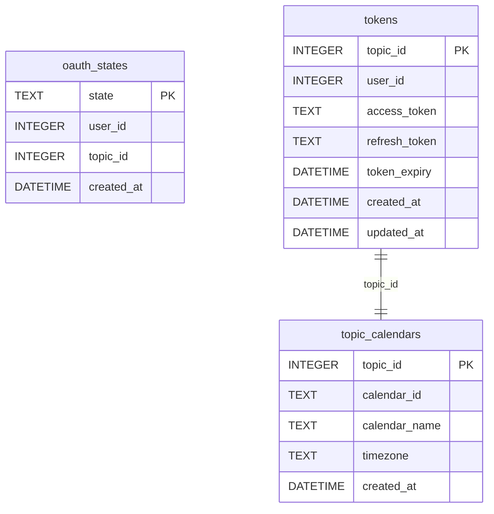

# feat: Add Google Calendar Integration

## Overview

Add a Google Calendar tool that lets topic members interact with a topic-owner's Google Calendar through bobot. Topic owners connect their Google Calendar via the settings page (OAuth2 flow), pick which calendar to use, and then all topic members can list, add, update, and delete events through natural language chat or `/calendar` slash commands.

This is the first OAuth2 integration in the codebase, introducing new infrastructure for authorization code flow, token storage, and refresh.

## Problem Statement

Users want to manage calendar events directly from their bobot chat topics without switching to Google Calendar. This enables natural language interactions like "what's on the calendar tomorrow?" or "add a meeting with John at 3pm Friday" alongside existing tools (tasks, schedules, quick actions).

## Proposed Solution

A new `tools/calendar/` package following the hybrid architecture pattern (Approach C from the brainstorm): self-contained tool with well-organized internal files for future extraction. Uses the official Google Calendar API v3 Go client library (`google.golang.org/api/calendar/v3`) and `golang.org/x/oauth2` for authentication.

## Technical Approach

### Architecture

```
tools/calendar/
├── calendar.go       # Tool interface implementation, subcommand routing
├── oauth.go          # OAuth2 flow: auth URL generation, callback handling, token refresh
├── client.go         # Google Calendar API client wrapper (list, create, update, delete)
├── db.go             # SQLite DB: tokens, calendar associations, OAuth state
└── calendar_test.go  # Tests
```

**Dependencies to add:**
```
google.golang.org/api/calendar/v3
google.golang.org/api/option
golang.org/x/oauth2
golang.org/x/oauth2/google
```

### Data Model

**File:** `tools/calendar/db.go`

```sql
-- Pending OAuth state (short-lived, for CSRF protection)
CREATE TABLE IF NOT EXISTS oauth_states (
    state TEXT PRIMARY KEY,
    user_id INTEGER NOT NULL,
    topic_id INTEGER NOT NULL,
    created_at DATETIME DEFAULT CURRENT_TIMESTAMP
);

-- OAuth tokens per topic (one calendar connection per topic)
CREATE TABLE IF NOT EXISTS tokens (
    topic_id INTEGER PRIMARY KEY,
    user_id INTEGER NOT NULL,
    access_token TEXT NOT NULL,
    refresh_token TEXT NOT NULL,
    token_expiry DATETIME NOT NULL,
    created_at DATETIME DEFAULT CURRENT_TIMESTAMP,
    updated_at DATETIME DEFAULT CURRENT_TIMESTAMP
);

-- Calendar association per topic
CREATE TABLE IF NOT EXISTS topic_calendars (
    topic_id INTEGER PRIMARY KEY,
    calendar_id TEXT NOT NULL,
    calendar_name TEXT NOT NULL,
    timezone TEXT NOT NULL,
    created_at DATETIME DEFAULT CURRENT_TIMESTAMP
);
```



**Note on encryption:** Tokens are stored as plaintext in `tool_calendar.db`, consistent with how the existing codebase handles secrets (JWT secret is in env, ThinQ token is in env). The SQLite file is on the server filesystem. If encryption is desired later, the well-organized file structure makes it easy to add an encryption layer in `db.go`.

### OAuth2 Flow

**State management:** Store a cryptographically random `state` string in the `oauth_states` table with a 10-minute TTL. Clean up expired states on each new OAuth initiation.

**PKCE:** Use S256 challenge for additional security. Store the verifier alongside the state in `oauth_states` (add a `verifier TEXT` column).

**Flow:**
1. `GET /api/calendar/auth?topic_id=N` — Generate state + PKCE verifier, store in DB, redirect to Google
2. Google redirects to `GET /api/calendar/callback?code=...&state=...`
3. Validate state against DB, exchange code for tokens with PKCE verifier
4. Store tokens in `tokens` table
5. Redirect to `GET /calendar/pick?topic_id=N` (calendar picker page)
6. User selects calendar, `POST /calendar/pick` saves to `topic_calendars`
7. Redirect back to `/settings?topic_id=N`

**Token refresh:** Use `golang.org/x/oauth2.Config.TokenSource()` which auto-refreshes expired tokens. Wrap with a persisting layer that saves refreshed tokens to DB. Use a per-topic `sync.Mutex` to prevent concurrent refresh race conditions.

**Refresh token invalidation:** When refresh fails (token revoked, expired), delete tokens from DB and return a clear error: "Google Calendar access was revoked. The topic owner needs to reconnect from settings."

### HTTP Routes

**File:** `server/server.go` (add to `routes()`)

```go
// Calendar OAuth + settings (behind sessionMiddleware)
s.router.HandleFunc("GET /api/calendar/auth", s.sessionMiddleware(s.handleCalendarAuth))
s.router.HandleFunc("GET /api/calendar/callback", s.sessionMiddleware(s.handleCalendarCallback))
s.router.HandleFunc("GET /calendar/pick", s.sessionMiddleware(s.handleCalendarPickPage))
s.router.HandleFunc("POST /calendar/pick", s.sessionMiddleware(s.handleCalendarPickSubmit))
s.router.HandleFunc("DELETE /api/calendar", s.sessionMiddleware(s.handleCalendarDisconnect))
```

### Tool Interface

**File:** `tools/calendar/calendar.go`

```go
type CalendarTool struct {
    db     *CalendarDB
    config *oauth2.Config
    mu     sync.Map // per-topic mutexes for token refresh
}

func (t *CalendarTool) Name() string        { return "calendar" }
func (t *CalendarTool) Description() string  { return "Manage Google Calendar events..." }
func (t *CalendarTool) AdminOnly() bool      { return false }
```

**Schema (LLM tool definition):**

```json
{
  "type": "object",
  "properties": {
    "command": {
      "type": "string",
      "enum": ["list", "create", "update", "delete"],
      "description": "The calendar operation to perform"
    },
    "title": {
      "type": "string",
      "description": "Event title (required for create, used for matching on update/delete)"
    },
    "start": {
      "type": "string",
      "description": "Start date/time in RFC3339 or YYYY-MM-DD format"
    },
    "end": {
      "type": "string",
      "description": "End date/time in RFC3339 or YYYY-MM-DD format"
    },
    "description": {
      "type": "string",
      "description": "Event description (optional)"
    },
    "event_id": {
      "type": "string",
      "description": "Google Calendar event ID (for update/delete when title is ambiguous)"
    },
    "start_date": {
      "type": "string",
      "description": "Start of date range for list (default: today)"
    },
    "end_date": {
      "type": "string",
      "description": "End of date range for list (default: 7 days from start)"
    }
  },
  "required": ["command"]
}
```

**Slash command parsing (`ParseArgs`):**

```
/calendar list [today|tomorrow|this week|YYYY-MM-DD]
/calendar create "Meeting with John" 2026-03-01T15:00 2026-03-01T16:00 "Discuss Q2 plans"
/calendar update <event_id> [--title "New Title"] [--start TIME] [--end TIME]
/calendar delete <event_id>
```

### Google Calendar API Client

**File:** `tools/calendar/client.go`

Wraps the official `google.golang.org/api/calendar/v3` client:

- `ListCalendars(ctx, tokenSource) ([]*CalendarInfo, error)` — For the picker UI
- `ListEvents(ctx, tokenSource, calendarID, timeMin, timeMax) ([]*EventInfo, error)` — List events in range
- `CreateEvent(ctx, tokenSource, calendarID, event) (*EventInfo, error)` — Create event
- `UpdateEvent(ctx, tokenSource, calendarID, eventID, updates) (*EventInfo, error)` — Patch event
- `DeleteEvent(ctx, tokenSource, calendarID, eventID) error` — Delete event
- `GetCalendarTimezone(ctx, tokenSource, calendarID) (string, error)` — Get calendar timezone

**Event listing defaults:** 10 events max, `SingleEvents(true)`, `OrderBy("startTime")`, `ShowDeleted(false)`.

**Timezone:** Use the connected calendar's timezone (stored in `topic_calendars.timezone`). Include it in the tool's output so the LLM can interpret times correctly.

**Error handling:** Map Google API errors to user-friendly messages:
- 401 → trigger refresh, retry once, or "Calendar disconnected" if refresh fails
- 404 → "Event not found"
- 429 → "Google Calendar is busy, try again in a moment"
- 5xx → "Google Calendar is temporarily unavailable"

### Settings Page Integration

**File:** `web/templates/settings.html`

Add a new entry in the "Topic Tools" `<details>` section, after quick actions:

```html
{{if .GoogleCalendarEnabled}}
<button class="settings-nav-item" {{if .CalendarConnected}}...{{else}}...{{end}}>
    <div class="settings-nav-info">
        <span class="settings-nav-label">{{t .Lang "settings.google_calendar"}}</span>
        {{if .CalendarConnected}}
        <span class="settings-nav-detail">{{.CalendarName}}</span>
        {{else}}
        <span class="settings-nav-detail settings-row-empty">{{t .Lang "settings.not_connected"}}</span>
        {{end}}
    </div>
    <svg><!-- chevron --></svg>
</button>
{{end}}
```

**Calendar picker page:** `web/templates/calendar_pick.html` — Shows list of user's Google Calendars with radio buttons, submit to select.

**Non-owner members:** See calendar status (read-only). Only topic owner and admins see Connect/Disconnect.

**Conditional visibility:** The entire calendar section is hidden if `BOBOT_GOOGLE_CLIENT_ID` is not configured (follows `GoogleCalendarEnabled` flag in `PageData`).

### Config Changes

**File:** `config/config.go`

```go
type Config struct {
    // ... existing fields ...
    GoogleClientID     string
    GoogleClientSecret string
}
```

Load from env:
```go
GoogleClientID:     os.Getenv("BOBOT_GOOGLE_CLIENT_ID"),
GoogleClientSecret: os.Getenv("BOBOT_GOOGLE_CLIENT_SECRET"),
```

**Redirect URI** derived from `cfg.BaseURL + "/api/calendar/callback"`.

### Server Integration

**File:** `server/server.go`

Add `calendarDB *calendar.CalendarDB` to the `Server` struct. Pass through constructor. Add calendar page handlers.

**File:** `main.go`

Conditional registration (following thinq pattern):
```go
if cfg.GoogleClientID != "" && cfg.GoogleClientSecret != "" {
    calendarDB, err := calendar.NewCalendarDB(filepath.Join(cfg.DataDir, "tool_calendar.db"))
    // ...
    calendarTool := calendar.NewCalendarTool(calendarDB, cfg.GoogleClientID, cfg.GoogleClientSecret, cfg.BaseURL)
    registry.Register(calendarTool)
    // Pass calendarDB to server for OAuth handlers
}
```

Log a warning if only one of the two env vars is set.

### i18n Keys

Add to both `en.json` and `pt-BR.json`:

```
settings.google_calendar
settings.not_connected
settings.connect_google_calendar
settings.disconnect_google_calendar
settings.connected_to
calendar.pick_title
calendar.pick_description
calendar.pick_submit
calendar.no_calendar_connected
calendar.disconnected
calendar.error_rate_limited
calendar.error_unavailable
calendar.error_not_found
calendar.event_created
calendar.event_updated
calendar.event_deleted
```

### Timezone Handling

- Store the calendar's timezone in `topic_calendars.timezone` when the user selects a calendar
- Include timezone in the tool's output for all operations (e.g., "Events are in America/Sao_Paulo timezone")
- The tool converts RFC3339 inputs using the calendar's timezone
- The LLM sees the timezone context and can interpret "3pm" correctly

### Recurring Events

- List operations use `SingleEvents(true)` to expand recurring events into individual instances
- Update/delete operate on the specific instance by default
- If the user asks to modify "all" instances, the LLM can pass the recurring event's master ID

### Concurrency

- Per-topic `sync.Mutex` (using `sync.Map`) for token refresh to prevent thundering herd
- Calendar API calls are otherwise independent and safe for concurrent use

## Implementation Phases

### Phase 1: Foundation (OAuth + DB + Config)

- [ ] Add Go dependencies: `google.golang.org/api`, `golang.org/x/oauth2`
- [ ] Create `tools/calendar/db.go` — `NewCalendarDB`, schema migration, CRUD for oauth_states, tokens, topic_calendars
- [ ] Create `tools/calendar/oauth.go` — OAuth config setup, auth URL generation, token exchange, token refresh with persistence, token revocation
- [ ] Add config fields `GoogleClientID`, `GoogleClientSecret` to `config/config.go`
- [ ] Add calendar DB initialization to `main.go` (conditional on env vars)
- [ ] Add `calendarDB` to `Server` struct and constructor

**Success criteria:** Can create DB, store/retrieve tokens, generate OAuth URLs.

### Phase 2: OAuth Web Flow + Settings UI

- [ ] Add OAuth routes to `server/server.go`: `/api/calendar/auth`, `/api/calendar/callback`
- [ ] Implement `handleCalendarAuth` — validate topic ownership, generate state + PKCE, redirect to Google
- [ ] Implement `handleCalendarCallback` — validate state, exchange code, store tokens, redirect to picker
- [ ] Create `web/templates/calendar_pick.html` — calendar picker page
- [ ] Implement `handleCalendarPickPage` — fetch user's calendars, render picker
- [ ] Implement `handleCalendarPickSubmit` — save selection, redirect to settings
- [ ] Add Google Calendar section to `web/templates/settings.html` (Topic Tools)
- [ ] Add `handleCalendarDisconnect` — revoke token, delete data
- [ ] Update `handleSettingsPage` in `server/pages.go` to load calendar status
- [ ] Add `GoogleCalendarEnabled`, `CalendarConnected`, `CalendarName` to `PageData`
- [ ] Add i18n keys to `en.json` and `pt-BR.json`

**Success criteria:** Topic owner can connect/disconnect Google Calendar from settings page.

### Phase 3: Calendar Tool (LLM + Slash Command)

- [ ] Create `tools/calendar/client.go` — Google Calendar API wrapper (ListCalendars, ListEvents, CreateEvent, UpdateEvent, DeleteEvent)
- [ ] Create `tools/calendar/calendar.go` — Tool interface implementation (Name, Description, Schema, ParseArgs, Execute)
- [ ] Implement `list` subcommand — fetch events in date range, format as text
- [ ] Implement `create` subcommand — create event, return confirmation with bobot tags
- [ ] Implement `update` subcommand — patch event by ID, return confirmation
- [ ] Implement `delete` subcommand — delete event by ID, return confirmation
- [ ] Register tool in `main.go` (conditional on env vars)
- [ ] Handle "no calendar connected" error gracefully in Execute
- [ ] Handle token refresh failures (disconnected calendar) gracefully

**Success criteria:** Can list/create/update/delete events via `/calendar` slash command and via LLM tool calls.

### Phase 4: Polish

- [ ] Add per-topic mutex for concurrent token refresh
- [ ] Handle Google API errors (429, 5xx) with user-friendly messages
- [ ] Clean up expired OAuth states on new OAuth initiation
- [ ] Clean up calendar tokens on topic soft-delete (add to `handleDeleteTopic`)
- [ ] Add `calendar_pick.js` if needed for picker UX
- [ ] Test end-to-end: connect → list → create → update → delete → disconnect
- [ ] Verify scheduled/cron jobs can invoke calendar tool correctly

**Success criteria:** Feature is robust, handles edge cases, and cleans up resources.

## Acceptance Criteria

### Functional Requirements

- [ ] Topic owner can connect Google Calendar from topic settings
- [ ] Topic owner can pick which calendar to associate with the topic
- [ ] Topic owner can disconnect the calendar from settings
- [ ] All topic members can list events via chat or `/calendar list`
- [ ] All topic members can create events via chat or `/calendar create`
- [ ] All topic members can update events via chat or `/calendar update`
- [ ] All topic members can delete events via chat or `/calendar delete`
- [ ] Calendar section hidden when `BOBOT_GOOGLE_CLIENT_ID` not set
- [ ] Calendar tool not registered when Google credentials not configured
- [ ] Non-owner members see read-only calendar status in settings

### Non-Functional Requirements

- [ ] OAuth state validated with CSRF protection
- [ ] PKCE used for OAuth code exchange
- [ ] Token refresh handles concurrency (per-topic mutex)
- [ ] Invalid refresh tokens detected and handled gracefully
- [ ] Google API errors (429, 5xx) return user-friendly messages
- [ ] All new UI strings have i18n keys in en.json and pt-BR.json
- [ ] Calendar data cleaned up on topic deletion

## Dependencies & Prerequisites

- Google Cloud project with Calendar API enabled
- OAuth consent screen configured (at minimum "Testing" mode for development)
- Environment variables: `BOBOT_GOOGLE_CLIENT_ID`, `BOBOT_GOOGLE_CLIENT_SECRET`
- `BOBOT_BASE_URL` must match the registered redirect URI in Google Cloud Console

## Risk Analysis & Mitigation

| Risk | Mitigation |
|------|-----------|
| Google consent screen in "Testing" mode (tokens expire 7 days) | Document that production requires OAuth verification |
| Concurrent token refresh invalidates refresh token | Per-topic sync.Mutex serializes refresh attempts |
| User revokes Google access externally | Detect on 401, mark as disconnected, prompt reconnect |
| Rate limit errors from Google API | Return friendly error, no retry logic (per brainstorm) |
| Redirect URI mismatch | Derive from BOBOT_BASE_URL, document Google Cloud Console setup |

## References & Research

### Internal References
- Tool interface: `tools/registry.go:11-18`
- ThinQ tool (external API pattern): `tools/thinq/thinq.go`, `tools/thinq/client.go`, `tools/thinq/db.go`
- Tool registration: `main.go:111-134`
- Settings page: `web/templates/settings.html`, `server/pages.go:508-615`
- Config: `config/config.go`
- Slash command flow: `server/chat.go:236-278`
- Brainstorm: `docs/brainstorms/2026-02-26-google-calendar-integration-brainstorm.md`

### External References
- [Google Calendar API v3 Go package](https://pkg.go.dev/google.golang.org/api/calendar/v3)
- [golang.org/x/oauth2](https://pkg.go.dev/golang.org/x/oauth2)
- [Google OAuth2 Web Server Flow](https://developers.google.com/identity/protocols/oauth2/web-server)
- [Google Calendar API Scopes](https://developers.google.com/workspace/calendar/api/auth)
- [Google Calendar API Events Reference](https://developers.google.com/workspace/calendar/api/v3/reference/events)
