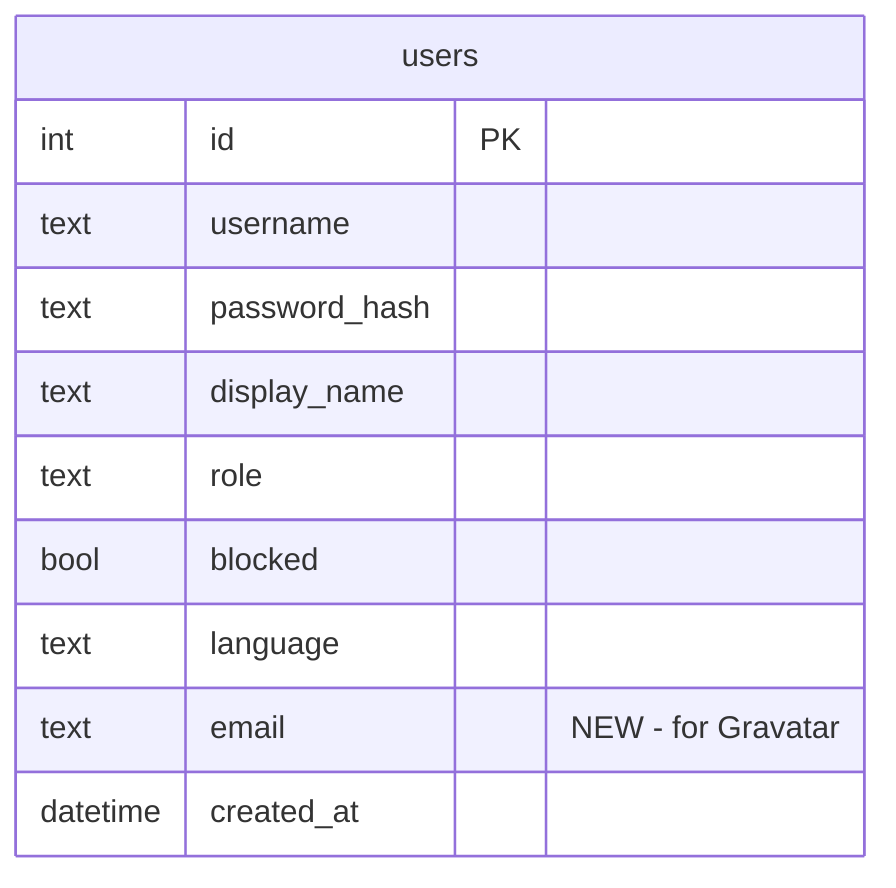

# feat: User Differentiation in Group Topics

## Overview

In group topics with multiple members, all non-self messages appear as identical gray boxes with only a small 12px display name. Users struggle to parse who said what. This plan adds Gravatar avatars and colored sender names with WhatsApp-style message grouping to make sender identification instant.

## Problem Statement

The screenshot in [#45](https://github.com/esnunes/bobot/issues/45) shows a conversation with 3 users and the assistant. All non-self messages look identical -- same gray background, same text color, same font size for the sender name. The only way to identify a sender is to read the small name label above each message.

## Proposed Solution

1. **Gravatar avatars** -- Each user gets a Gravatar image derived from their email (set in settings). Fallback: gray silhouette.
2. **Colored sender names** -- 6 bold colors assigned per-topic by member join order.
3. **WhatsApp-style grouping** -- Consecutive messages from the same sender are grouped: name on first, avatar on last, each message gets its own bubble.
4. **Server-side Gravatar URL computation** -- Never expose email addresses to the client.

## Technical Approach

### Phase 1: Backend -- Email Field + Gravatar URLs

#### 1a. Add `email` column to `users` table

**File:** `db/core.go`

Add to `User` struct (line 47):
```go
type User struct {
    // ... existing fields ...
    Email     string
}
```

Add migration in `migrate()` (after line 180):
```go
if err := c.addColumnIfMissing("users", "email", "TEXT NOT NULL DEFAULT ''"); err != nil {
    return err
}
```

Update all user scan methods to include `email`:
- `GetUserByUsername` (line 725)
- `GetUserByID` (line 743)
- `ListActiveUsers` (line 990)

Add `UpdateUserEmail` method following the `UpdateUserDisplayName` pattern (line 1510).

#### 1b. Add `/api/user/email` endpoint

**File:** `server/pages.go`

Add `handleUpdateEmail` following the `handleUpdateDisplayName` pattern (lines 663-683). Basic validation: trim whitespace, lowercase. No uniqueness constraint. Empty string allowed (clears email).

**File:** `server/server.go`

Register route (after line 164):
```go
mux.HandleFunc("POST /api/user/email", s.requireAuth(s.handleUpdateEmail))
```

#### 1c. Gravatar URL helper

**File:** `server/pages.go` (or a new `server/gravatar.go`)

```go
func gravatarURL(email string, size int) string {
    if email == "" {
        return fmt.Sprintf("https://www.gravatar.com/avatar/?d=mp&s=%d", size)
    }
    hash := md5.Sum([]byte(strings.TrimSpace(strings.ToLower(email))))
    return fmt.Sprintf("https://www.gravatar.com/avatar/%x?d=mp&s=%d", hash, size)
}
```

Size: 80px (good quality for 32-40px display size on retina).

#### 1d. Include members in PageDataJSON

**File:** `server/pages.go` -- `handleTopicChatPage` (lines 511-517)

Add `MemberView` with Gravatar URL:

```go
type MemberView struct {
    UserID      int64  `json:"user_id"`
    Username    string `json:"username"`
    DisplayName string `json:"display_name"`
    GravatarURL string `json:"gravatar_url"`
}
```

Build member views with Gravatar URLs from the `dbMembers` list (line 443). Add `"members": memberViews` to the PageDataJSON marshal call.

**Bobot handling:** Bobot (user ID from the bobot user record) is not in `topic_members`. Programmatically prepend bobot to the members list with a static avatar URL (e.g., `/static/bobot-avatar.png` or a robot icon). This gives bobot position 0 in the color array.

### Phase 2: Settings Page -- Email Input

#### 2a. Settings template

**File:** `web/templates/settings.html`

Add email form after the display name form (line 143), following the same pattern:
```html
<form class="settings-email-form" id="email-form">
    <label class="settings-row-label" for="email-input">{{t .Lang "settings.email"}}</label>
    <div class="settings-email-row">
        
        <input type="email" id="email-input" name="email" value="{{.Email}}" autocomplete="email" maxlength="254">
        <button type="submit" class="settings-save-btn">{{t .Lang "settings.save"}}</button>
    </div>
    <span class="settings-saved-msg" id="email-saved" style="display:none">{{t .Lang "settings.saved"}}</span>
</form>
```

Include a small Gravatar preview image next to the input so users can verify.

#### 2b. Settings JavaScript

**File:** `web/static/settings.js`

Add email form handler following the display name handler pattern (lines 17-53). On successful save, update the preview image `src` attribute.

#### 2c. Settings page data

**File:** `server/pages.go` -- `handleSettingsPage` (line 544)

Pass `Email` and `GravatarURL` in PageData.

#### 2d. Translations

Add `settings.email` key to all language files (check `web/translations/` or equivalent i18n source).

### Phase 3: Frontend -- Color Assignment + Avatar Rendering

#### 3a. Color palette

**File:** `web/static/tokens.css`

Add 6 bold member colors as CSS custom properties. Pick from Catppuccin Latte accents with good contrast against `--colors-surface` (#e6e9ef):

```css
--colors-member-0: #d20f39; /* Red */
--colors-member-1: #1e66f5; /* Blue */
--colors-member-2: #40a02b; /* Green */
--colors-member-3: #fe640b; /* Peach/Orange */
--colors-member-4: #8839ef; /* Mauve/Purple */
--colors-member-5: #179299; /* Teal */
```

#### 3b. Member color map in topic_chat.js

**File:** `web/static/topic_chat.js`

In `loadInitialMessages()` (line 38), read `data.members` and build:
```javascript
this.memberMap = {}; // keyed by user_id
data.members.forEach((m, index) => {
    this.memberMap[m.user_id] = {
        displayName: m.display_name,
        gravatarURL: m.gravatar_url,
        colorIndex: index % 6,
    };
});
```

For messages from unknown senders (departed members, edge cases), fall back to a neutral gray color and the default Gravatar silhouette.

#### 3c. Avatar + colored name rendering

**File:** `web/static/topic_chat.js`

Modify `addMessage()` (line 154) and `prependMessage()` (line 331):

For non-self messages:
1. Look up sender in `this.memberMap` by `userId`
2. Set `--member-color` CSS custom property on the message element (or apply a `data-color-index` attribute)
3. Render `.message-sender` with the member color
4. Render `.message-avatar` (a small `` with Gravatar URL, in a colored circle border)

#### 3d. WhatsApp-style message grouping

**File:** `web/static/topic_chat.js`

**Grouping rules:**
- Consecutive messages with the same `user_id` AND same `role` form a streak
- First message in streak: show sender name, no avatar
- Last message in streak: show avatar, no name
- Single message (both first and last): show both name and avatar
- Middle messages: no name, no avatar (rely on streak visual context)

**For `addMessage()` (append):**
1. Check the last `.message` element in the container
2. If same sender+role: the previous message was "last in streak" -- remove its avatar, mark it as "middle". The new message becomes "last in streak" (with avatar).
3. If different sender+role: the new message starts a new streak (show name).

**For `prependMessage()` (history prepend):**
1. After prepending, check the boundary between the last prepended message and the first existing message
2. If same sender+role: merge the streaks (update name/avatar visibility at the boundary)

#### 3e. CSS for avatars and colored names

**File:** `web/static/style.css`

```css
.message-avatar {
    width: 32px;
    height: 32px;
    border-radius: 50%;
    object-fit: cover;
    flex-shrink: 0;
}

.message-sender {
    /* Override existing secondary color with member color */
    color: var(--member-color, var(--colors-text-secondary));
}
```

Adjust `.message` layout to accommodate avatar placement (avatar appears beside the last message in a streak).

### Phase 4: Feature Gating

Only render avatars and colored names when the topic has more than 1 non-self participant. In 1:1 bobot topics, the feature is unnecessary since left/right alignment already distinguishes the two participants.

Check: `data.members.length > 2` (self + bobot + at least one other human) or similar threshold based on member count.

## Acceptance Criteria

- [ ] Users can set their email in the settings page
- [ ] Settings page shows a Gravatar preview after saving email
- [ ] Group topic messages show Gravatar avatars for non-self senders
- [ ] Users without email get the default gray silhouette avatar
- [ ] Sender names are colored per-topic (6 distinct colors)
- [ ] Consecutive messages from the same sender are grouped (WhatsApp-style)
- [ ] Grouping works correctly for both initial load and real-time WebSocket messages
- [ ] Grouping works correctly when loading history (scroll up)
- [ ] Bobot gets a recognizable avatar (static robot icon) and a color
- [ ] Self messages are unchanged (right-aligned lavender, no avatar)
- [ ] Feature is inactive in 1:1 bobot topics
- [ ] Email addresses are never exposed to the client (server-side Gravatar URL computation)
- [ ] Messages from departed topic members show neutral gray color + default avatar

## ERD Changes



## Dependencies & Risks

**Dependencies:**
- External: Gravatar service availability (graceful degradation via `d=mp` default)
- Internal: crypto/md5 Go standard library (already available)

**Risks:**
- **Grouping complexity:** DOM mutation of previously rendered messages adds complexity to `addMessage()` and `prependMessage()`. Recommend thorough testing with various message sequences.
- **Color stability:** Colors shift when members leave a topic. This is accepted as a minor trade-off for simplicity (no stored color index).
- **Gravatar latency:** First load of Gravatar images may be slow. Browser caching mitigates subsequent loads. Consider lazy loading (`loading="lazy"` on ``).

## References

### Internal
- Brainstorm: `docs/brainstorms/2026-02-27-user-differentiation-brainstorm.md`
- User model: `db/core.go:38-47`
- DB migrations: `db/core.go:121-494`
- Settings page: `web/templates/settings.html:134-167`
- Settings JS: `web/static/settings.js:17-53`
- Message rendering: `web/static/topic_chat.js:154-201`
- PageDataJSON: `server/pages.go:511-517`
- Topic members query: `db/core.go:1190-1212`
- Design tokens: `web/static/tokens.css`

### Institutional Learnings
- Validate CSS tokens exist in `tokens.css` before using them (invisible-unread-indicator)
- Use SSR for initial state, JS for real-time updates only (inconsistent-unread-indicator)
- Register event listeners synchronously in constructors (architecture-patterns)

### External
- Gravatar API: `https://docs.gravatar.com/api/avatars/images/`
